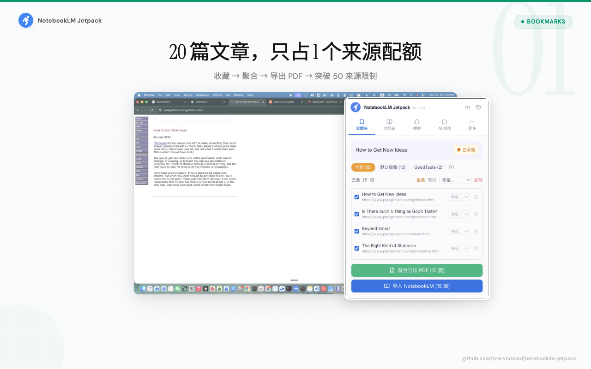
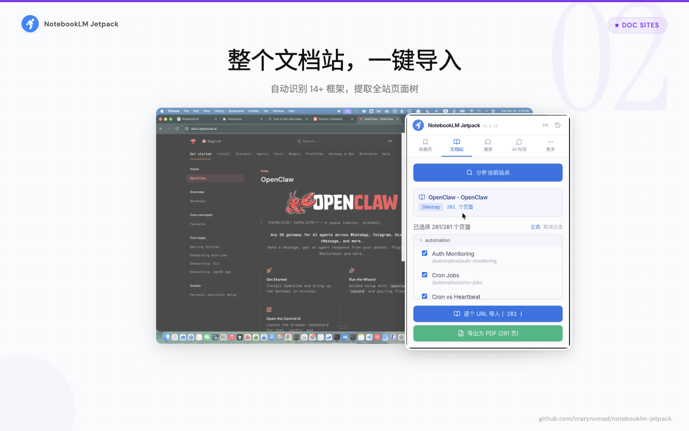
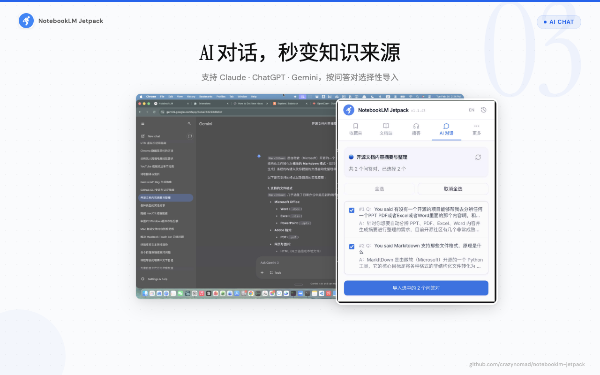
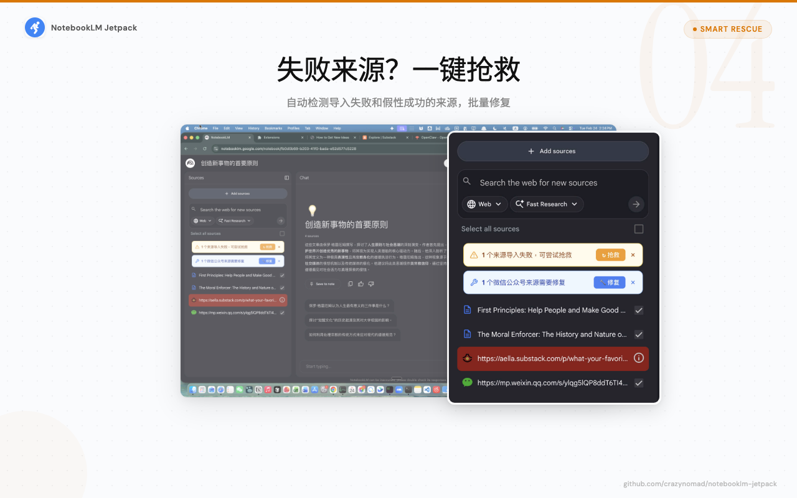

<p align="right">
  <strong>中文</strong> | <a href="README.md">English</a>
</p>

<p align="center">
  
</p>

<h1 align="center">NotebookLM Jetpack 🚀</h1>

<p align="center">
  <strong>给 NotebookLM 装上喷射背包 — 一键导入网页、Substack、播客、文档站、AI 对话。</strong><br>
  聚合多篇文章为一个来源，突破 50 个来源的限制。
</p>

<p align="center">
  <a href="https://jetpack.boing.work/">📖 文档</a> •
  <a href="https://www.youtube.com/watch?v=9gPTuJZRHJk">🎬 演示视频</a> •
  <a href="https://jetpack.boing.work/privacy">🔒 隐私政策</a> •
  <a href="https://github.com/crazynomad/notebooklm-jetpack/releases/latest">📦 下载</a>
</p>

<p align="center">
  <strong>完全免费 · 无需登录 · 本地运行 · 开源</strong>
</p>

---

## 🎬 演示

[](https://www.youtube.com/watch?v=9gPTuJZRHJk)

---

## ✨ 功能

### 🔌 智能导入 — 修复无法导入的链接

NotebookLM 的 URL 导入在很多热门来源上会静默失败，Jetpack 全部搞定：

- **Substack** — 精准提取正文，14 种噪声过滤（订阅按钮、评论区等）
- **微信公众号文章** — 浏览器内渲染完整页面，绕过反爬机制
- **X.com (Twitter) 长文** — 自动识别长文格式，完整提取
- **动态/SPA 页面** — NotebookLM 抓不到的 JS 渲染页面？搞定

### 📦 突破 50 个来源限制

内置**稍后阅读**收藏夹，收集文章后聚合 10-20 篇为一个 PDF。一个 PDF = 一个来源位 = 20 篇文章的知识量。



### 📚 批量导入整个文档站

打开任意文档页面 → **分析站点** → 自动识别框架 → 选择章节 → 批量导入或导出为 PDF。

支持 **14+ 框架**：Docusaurus · VitePress · MkDocs · GitBook · Mintlify · Sphinx · ReadTheDocs · Google DevSite · Anthropic Docs · 语雀 · 微信开发文档 · 鸿蒙文档 — 以及任何有 `sitemap.xml` 或 `llms.txt` 的站点。



### 🤖 AI 对话导入

在 **Claude、ChatGPT 或 Gemini** 的对话页面打开扩展，自动提取问答对，选择性导入到 NotebookLM 作为结构化内容。



### 🛟 智能故障检测与抢救

自动扫描笔记本中的所有来源，标记失败和静默损坏的导入，然后**一键抢救**。



### 🎙️ 播客导入

粘贴 Apple Podcasts 或小宇宙链接 → 选择剧集 → 下载音频 → 拖入 NotebookLM。


### ⚡ 更多功能

| 功能 | 描述 |
|------|------|
| 📡 RSS 导入 | Substack、Medium 及任何标准 RSS/Atom 订阅源 |
| 🖱️ 右键菜单 | 右键即可导入当前页面 |
| 📋 导入历史 | 最近 100 条记录，随时查看 |
| 🌐 双语界面 | 中英文自动切换，跟随浏览器语言 |

---

## 📥 安装

### Chrome 应用商店（推荐）

[**从 Chrome 应用商店安装**](https://chromewebstore.google.com/detail/notebooklm-jetpack/jgjgpfgcbdblgejodmooigkhlciejjhg) — 一键安装，自动更新。

### 从 GitHub Release 安装

1. 从 [Releases](https://github.com/crazynomad/notebooklm-jetpack/releases/latest) 下载最新 `.zip` 文件
2. 打开 Chrome → 地址栏输入 `chrome://extensions/`
3. 开启右上角的**开发者模式**
4. 将 `.zip` 文件拖入页面，或解压后点击**加载已解压的扩展程序**

### 从源码构建

```bash
git clone https://github.com/crazynomad/notebooklm-jetpack.git
cd notebooklm-jetpack
pnpm install
pnpm build
```

然后将 `dist/chrome-mv3` 作为已解压的扩展程序加载。

---

## 🛠️ 开发

```bash
pnpm dev        # 开发模式（HMR，端口 3003）
pnpm build      # 生产构建
pnpm test       # 运行测试
pnpm compile    # TypeScript 类型检查
pnpm lint       # 代码检查
```

## 🏗️ 技术栈

- [WXT](https://wxt.dev/) — Chrome 扩展框架（Manifest V3）
- [React 18](https://react.dev/) — 界面
- [TypeScript](https://www.typescriptlang.org/) — 类型安全
- [Tailwind CSS](https://tailwindcss.com/) — 样式
- [Vitest](https://vitest.dev/) — 测试

---

## 🔒 隐私

- 无需登录，不收集任何用户数据
- 完全在浏览器本地运行，不向第三方服务器发送数据
- 开源可审计
- 符合 Chrome Manifest V3 规范

查看 [隐私政策](https://jetpack.boing.work/privacy)。

---

## 📄 许可证

MIT

---

<p align="center">
  <em>Made by <a href="https://www.youtube.com/@greentrainpodcast">绿皮火车 🚂</a></em>
</p>
